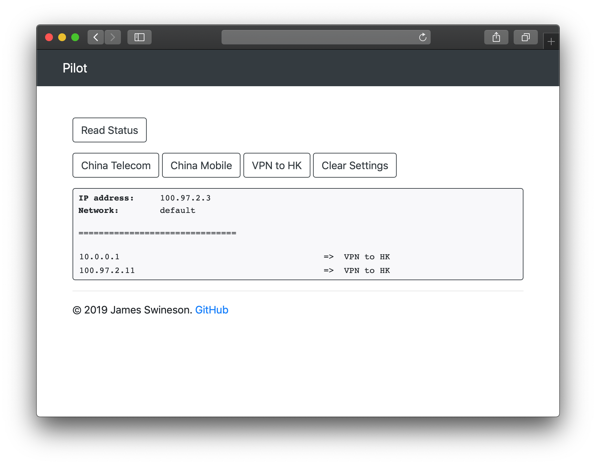

# Pilot

Simple web-based network controller for SDN at home. 

[](https://dev.azure.com/nekomimiswitch/General/_build/latest?definitionId=81&branchName=master)

## Introduction

Pilot acts as a frontend for GoBGP, which allows any device in your LAN to open a web page and select their own network profile based on pre-defined route targets.



## Requirements

Server running Pilot:
* Python 3.7 or later
* LAN devices do not need SNAT/masquerade to access the server

Router (network gateway):
* Has VRF-Lite capability
* Supports [BGP flowspec](https://tools.ietf.org/html/rfc5575)

## Usage

### Router Setup

* Put different network profiles are put in different VRFs
* Add BGP session with your GoBGP instance and enable `ipv4 flowspec` and `ipv6 flowspec` address families
* Allow flowspec rule installation on the interfaces to LAN clients

### GoBGP Setup

A minimal example configuration:

```toml
[global.config]
  as = 65540
  router-id = "192.168.1.1"

[[neighbors]]
  [neighbors.config]
    neighbor-address = "your.router.ip.address"
    peer-as = 65540
  [[neighbors.afi-safis]]
    [neighbors.afi-safis.config]
      afi-safi-name = "ipv4-flowspec"
  [[neighbors.afi-safis]]
    [neighbors.afi-safis.config]
      afi-safi-name = "ipv6-flowspec"
  [neighbors.apply-policy.config]
    default-import-policy = "reject-route"
    default-export-policy = "accept-route"
```

Details see [GoBGP documentation](https://github.com/osrg/gobgp/blob/master/docs/sources/configuration.md).

### Pilot Setup

Just spin up the program:

```shell script
python3 -m pilot --config path/to/pilot.toml
```

## Thanks

This project is inspired by [xtomcom/NetworkSwitch](https://github.com/xtomcom/NetworkSwitch).